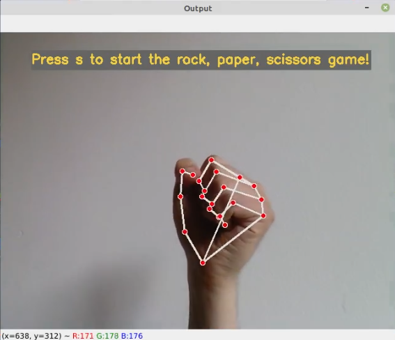
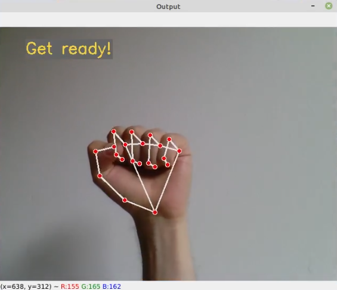
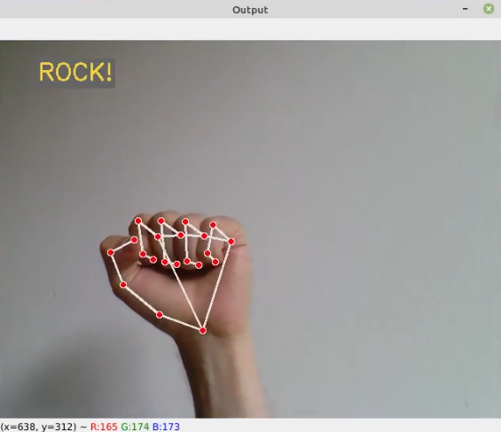
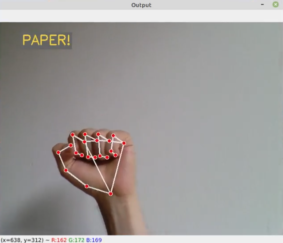
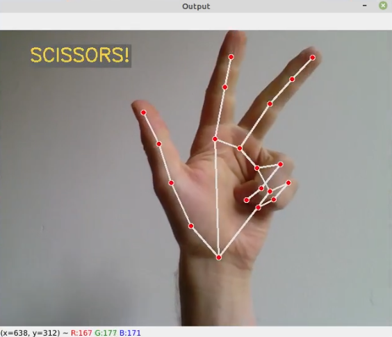
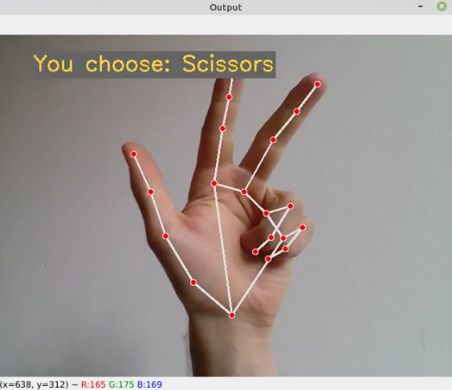
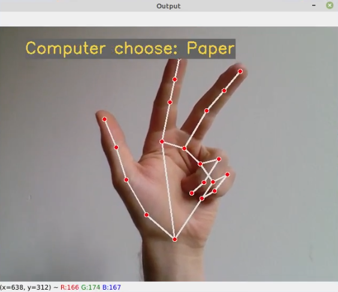
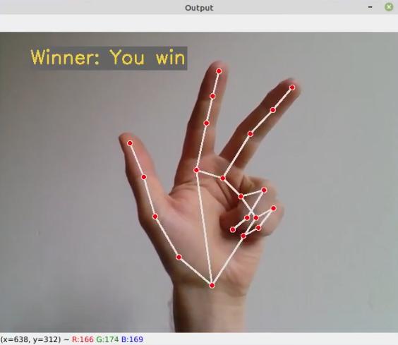

# Hands_RPS

## Description

Hands_RPS is a simple Rock, Paper, Scissors game which can be played against a computer using a webcam.         
In order to determine the shown gesture the following pipeline is used:
1. Hand recognition from Googles MediaPipe delivers 21 special points located at fixed positions on the shown hand.
2. Using normalized distances between all these 21 points delivers spatial immutability.
3. This data is used to train a simple feed forward neural network for classification.

## How to use

In order to train and use this program the following steps need to be followed:
1. Record different hand gestures with the record_data.py script.
2. Train the neural network with the train_pose.py script.
3. Execute the main.py script in order to play a game.

## How to play

After starting the main.py script the game will wait for the player to press "s" in order to start the game.
As common in any rock, paper, scissors game the computer will count the player in with "ROCK", "PAPER" and finally "SCISSORS".
With the last count the player is supposed to show the gesture he choose into the webcam. The game will recognize the shown gesture and
compares it with the one chosen by the computer to determine a winner.

## Example

This example shows a game where the player choose scissors and the computer choose paper. Thus the player won.

